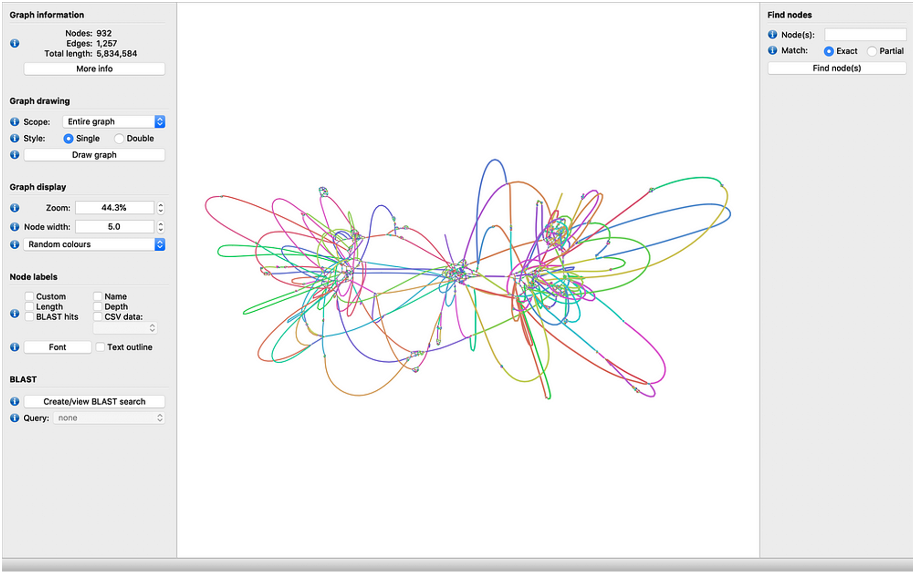

## Metagenome assembly

The next step is to assemble these reads into longer sequences, taking advantage of the long overlaps one would expect in PacBio reads. 
The goal is to reconstruct individual genomes, or bins, representing the genomic content of different microbial species within the community.
However, this process will require several steps. 
First, we will aim to identify contiguous sequences (contigs) from our reads, which will represent segments of the genomes. 
Metagenomic assembly is a computationally intense task, and many different tools exist that can do this, 
each with its own strengths and weaknesses. However, these analyses usually take a few hours. 
To bypass these long runtimes, two different assemblers have already been run, and you can find the result files in:
~~~
ls -l ~/data_bb3bcg20/Block1/COOI/Intermediate_files/Assembly
~~~

### First assembler: miniasm 

One of these assemblers, miniasm, is a relatively simple Overlap-Layout-Consensus wrapper. 
Take a look at the resulting Fasta file. 

> ## Exercise: Examine the miniasm metagenome assembly
>
> **- How many contigs did miniasm identify?**
> **- What is the size range of these contigs?**
> 
>> ## Solution
>>
>> `grep -c ">" ~/data_bb3bcg20/Block1/COOI/Intermediate_files/Assembly/miniasm/assembly_miniasm.fasta`
>> 
>> 181 contigs.
>> 
>> `seqkit stats ~/data_bb3bcg20/Block1/COOI/Intermediate_files/Assembly/miniasm/assembly_miniasm.fasta`
>> 
>> From ca. 13 kbp to ca. 3.6 Mbp
> {: .solution}
{: .challenge}

To get more information about the effect of the polishing steps, let’s take a better look at the contig length distribution. Let's
First, let's get access to the correct files:

~~~
$ cd ~/GenomeBioinformatics/Block1/COO-I/Results
$ mkdir 03_assembly_miniasm
$ cd 03_assembly_miniasm
$ ln -s ~/data_bb3bcg20/Block1/COOI/Intermediate_files/Assembly/miniasm/ .
~~~
{: .bash}

> ## Exercise: Examine additional statistics related to the miniasm metagenome assembly
>
> Write a python script that can read sequences from a fasta file, and prints the length of each contig in a separate line.
> Once you have done that, print that information to a file.
>
> You can also simply use the python script in 'data_bb3bcg20/bin/scripts/fasta_length.py'
>
> However, in order to use Python 3, you will need to generate a conda environment that can run python 3. Do it by running:
> `conda create --name python3.11 python=3.11`
>
> Once the environment is created, you can activate it by doing:
> `$ conda activate python3.11`
> 
> Once you are done with this environment, you can go back to the previous environment by running
> `$ conda deactivate`
> 
> Now run your script and generate a file with the contig lengths called "assembly_miniasm.fasta.contigLengths".
> Then run the following script:
> `$ perl ~/data_bb3bcg20/bin/scripts/stats.pl assembly_miniasm.fasta.contigLengths`
> 
> 
>> ## Solution
>>
>> `$ python ~/data_bb3bcg20/bin/scripts/fasta_length.py assembly_miniasm.fasta | cut -f2 > assembly_miniasm.contigLengths`
>> 
>> `$ perl ~/data_bb3bcg20/bin/scripts/stats.pl assembly_miniasm.contigLengths`
>> 
>> N = 181
>> 
>> Sum: 16216279
>> 
>> Mean: 89592.701657
>> 
>> Var: 139285829786.486
>> 
>> SD: 373210.168386
>> 
>> SE: 27740.493348
>>
>> MAD: 12274
>> 
>> Min: 12926
>> 
>> p10: 18795
>> 
>> p25: 23405
>> 
>> Median: 34524
>> 
>> p75: 48697
>> 
>> p90: 98795
>> 
>> Max: 3611276
> {: .solution}
{: .challenge}

### Second assembler: flye 

A more sophisticated assembler has also been run: flye. 
You can find the results of this assembly, as well as intermediate assembly files, in the corresponding folder.
~~~
$ cd ~/GenomeBioinformatics/Block1/COO-I/Results
$ mkdir 04_assembly_flye
$ cd 04_assembly_flye
$ ln -s ~/data_bb3bcg20/Block1/COOI/Intermediate_files/Assembly/flye/ .
~~~

> ## Exercise: Examine the flye assembly
> How many contigs did flye identify? How does the distribution of contig sizes compare to the results by miniasm?
>> ## Solution
>> `$ conda activate python3.11`
>> 
>> `$ python ~/data_bb3bcg20/bin/scripts/fasta_length.py flye/assembly.fasta | cut -f2 > assembly_flye.contigLengths`
>> 
>> `$ perl ~/data_bb3bcg20/bin/scripts/stats.pl assembly_flye.contigLengths`
>> 
>> N = 267
>> 
>> Sum: 18428211
>> 
>> Mean: 69019.516854
>> 
>> Var: 75039714194.2722
>> 
>> SD: 273933.777023
>> 
>> SE: 16764.474901
>> 
>> MAD: 12884
>> 
>> Min: 6040
>> 
>> p10: 12091.5
>> 
>> p25: 18009.5
>> 
>> Median: 28323
>> 
>> p75: 51918
>> 
>> p90: 80768
>> 
>> Max: 3541958
> {: .solution}
{: .challenge}

To learn more about the assembly process, take a look at the assembly file within the folder “00-assembly”. 
How many contigs were generated at that point? How does this compare with the number of final contigs produced by flye?

## Assembly metrics using Quast

To get better metrics for these assemblies, we can use Quast. This is a software that evaluates assembly quality 
by measuring metrics such as contig length, Nx values, read mapping, and gene annotation.

Like usual, explore the options available at Quast by doing:
~~~
quast -h
~~~
{: .bash}

> ## Exercise: Run Quast on the obtained assemblies
> 
>> ## Solution
>>
>> `cd ~/GenomeBioinformatics/Block1/COO-I/Results/03_assembly_miniasm`
>>
>> `quast -o quast_miniasm --pacbio ../../Data/Course_sample_metagenome.fastq.gz miniasm/assembly_miniasm.fasta`
>>
>> `cd ~/GenomeBioinformatics/Block1/COO-I/Results/04_assembly_flye`
>> 
>> `quast -o quast_flye --pacbio ../../Data/Course_sample_metagenome.fastq.gz flye/assembly.fasta`
>>
> {: .solution}
{: .challenge}

Copy the Quast reports to your laptop and interpret the results. Check both the report.pdf file and the icarus viewer report (the latter will open in your browser).

> ## Exercise: Interpret the Quast reports
>
> -	What do the Nx distributions represent, and how do they differ between these two assemblies? 
>
> -	What percentage of reads map back to the assemblies? What percentage of reads are properly paired, and why do you think that is the case?
>
> -	How do the GC% distributions differ, and what do you think they imply about the microbial community under study?
>> ## Solution
>>
>> Nx plots represent the size of the shortest contig such that X% of the total assembly length is made up of contigs of that length or longer.
>>
>> Properly paired: 0%. Because we do not have paired-end reads -- this is not a trait of PacBio sequencing.   

## Assembly graphs using Bandage

In order to get a visual impression of how good the assembly is, it is always a good idea to take a look at the assembly graph. 
Assembly graphs are representations of contigs, including possible interactions between them. 
These graphs include contigs as coloured paths, and are drawn to scale. The contigs form loops, 
in such a way that their end-points link to other parts of the assembly for which some information in the 
data indicates possible, but not clear, assembly paths. One such example can be seen in the image below, from the software Bandage:

Perform this analysis in your own laptop, for the two assemblies we are inspecting. Download the software from their website 
(https://rrwick.github.io/Bandage/) and open it. 
Download the assembly graphs (".gfa" files) using "scp" like before. Load one of the assembly graphs into Bandage and click 
on “Draw graph”. If Bandage does not work for you, feel free to take the corresponding Intermediate file.
Do this for both assemblies and compare the results. What do you see? What is your impression of these assemblies 
based on the graphs?
