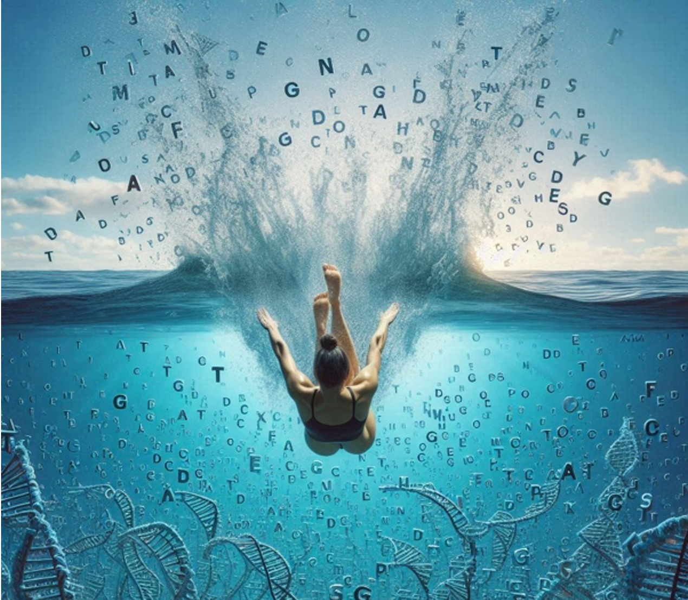

#  Making sense out of the recovered genomes

Your efforts are proving fruitful. You used PacBio long reads in order to assemble your metagenome, and binned the assembly into Metagenome-Assembled Genomes of various species. 

In the last COO, we focused on very high quality bins (over 70% completeness and less than 1% contamination estimates from CheckM). However, there are some additional bins that were not selected but could still be interesting. With a new Bin refinement effort, we have now used MetaWrap to output bins with completeness scores over 50%, and contamination scores below 5%. Start by taking a look at these results:
~~~
less ~/data_bb3bcg20/Block1/COOII/Data/Metawrap_BinRefinement_c50_x5/metawrap_50_10_bins.stats
~~~
{: .bash}

There are three bacterial bins that are classified at low taxonomic rank (indicating likely precision in the identification of sequence similarity against known taxa). However, your microbial community included two archaeal genomes that we still can’t tell what they are. Euryarchaeota is an extremely diverse group. And one of your bins is simply classified as “Archaea”.

Let’s take a deeper dive!

Steps to follow today:
- Genome annotation
- 16S rRNA phylogeny
- Phylogenomic reconstruction
