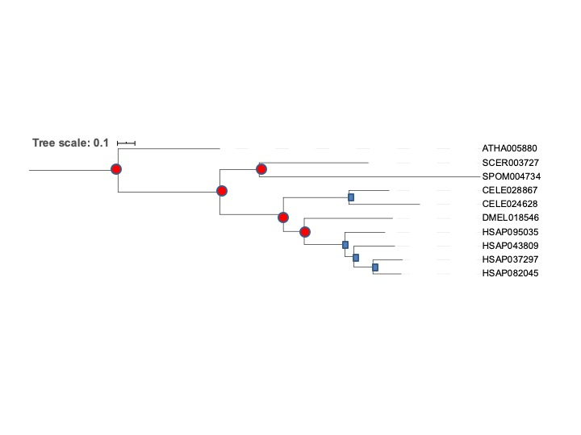
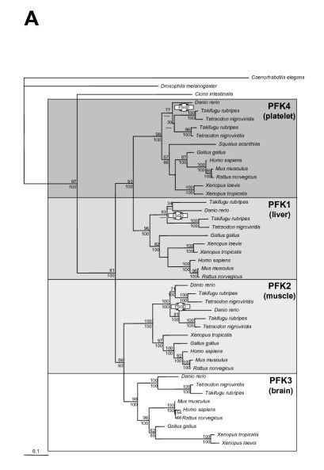

[//]: # (maybe give instructions on making a folder block2 and make a folder COOI to work in, use examples from Dani)

In this exercise, our goal is to infer the evolutionary history of a human protein starting from its sequence. This evolutionary history should reveal the orthologs in other species and the timing of the duplicates of our protein. We are going to use the human 6-phosphofructo-2-kinase / fructose-2,6-bisphosphatase as a starting point. This bi-functional enzyme (hence the long name) is an enzyme that catalyzes formation as well as degradation of a significant allosteric regulator of glycolysis and gluconeogenesis:  fructose-2,6-bisphosphate. 
          
Go to  [http://www.uniprot.org/uniprot/Q16877](http://www.uniprot.org/uniprot/Q16877) . Quickly scan the page. And see what kind of information uniprot has available and to what kind of databases uniprot cross references. 

In the uniprot page, click on sequence & isoforms, and there click on download. Copy all the text, i.e. the sequence and the fasta header. (see [https://en.wikipedia.org/wiki/FASTA_format](https://en.wikipedia.org/wiki/FASTA_format) if you want to know what a fasta header is / means)

Open a text editor on your local laptop (e.g. textedit, notepad++) , and copy the protein sequence of Q16877 into a text file. Save the protein sequence as a text file named “query.txt”. Then use `scp` to copy the text file to your gemini folder where we are doing these exercises.
[//]: # (maybe give syntax for doing the scp????)

Check how your file looks on gemini by typing e.g. `more query.txt`, or `less query.txt`.
[//]: # (maybe turn this into an exercise solution queston so that people can check that they got the correct file)

Now we are going to run blast with the human 6-phosphofructo-2-kinase / fructose-2,6-bisphosphatase  as a starting point. We are going to do this via `blastp -query query.txt -db ~/data_bb3bcg20/Block2/COOI/proteomes1.fa > tmp.out`
Look at the output, using (for example e.g. `more tmp.out` or `less tmp.out`). Proteins starting with HSAP are human. ATHA is a plant, CELE is a nematode worm, DMEL is the fruitfly, SCER is baker’s yeast, SPOM is fission yeast. 
> ## Exercise: How many hits with E-value < 1e-10 do you see in human, plant, worm and fly?
>
>> ## Solution
>>      HSAP037297                                                          979     0.0   
>>      HSAP082045                                                          743     0.0   
>>      HSAP043809                                                          671     0.0   
>>      HSAP095035                                                          667     0.0   
>>      DMEL018546                                                          529     0.0   
>>      CELE028867                                                          477     3e-166
>>      CELE024628                                                          437     2e-150
>>      SCER003727                                                          406     2e-138
>>      ATHA005880                                                          345     1e-110
>>      SPOM004734                                                          304     4e-99 
>>      SCER001206                                                          298     3e-92 
>>      SPOM002399                                                          287     3e-89 
>>      SPOM003505                                                          253     5e-77 
>>      SCER000727                                                          202     1e-58 
>>      SPOM001690                                                          166     2e-45
>>
>> So, HSAP 4, DMEL, 1, CELE 2, ATHA 1
> {: .solution}
{: .challenge}

Still looking at the blastoutput file, look at the pairwise alignment between your query and its best hit in DMEL.

> ## Exercise:  What is the percent identity with the best hit in fly?
>> ## solution
>>`> DMEL018546`\
>> `Length=716`\
>>
>>  `Score = 529 bits (1363),  Expect = 0.0, Method: Compositional matrix adjust.`\
>>  `Identities = 258/456 (57%), Positives = 329/456 (72%), Gaps = 5/456 (1%)`\
>> so precent identity 57%
> {: .solution}
{: .challenge}

We want to create a fasta file in order to make a tree of the hits in plants, in animals (fly, worm, human) with E-value < 1e-10; and of the best hit in fission yeast (SPOM) and the best hit in baker’s yeast SCER. To do so:

Copy the identifiers of the sequences you want for the tree into a text file on your laptop, each identifier should be followed by a newline. Copy this file to gemini using `scp`. Then use `seqtk subseq [fasta database] [name of your list of identifiers] > [your new file of homologous e.g. homs.fa]`   

Run mafft on your fasta file. i.e. `mafft [yourfile e.g. homs.fa] > [name of alignment file, e.g. homs.msa]`

Then run iq tree e.g. `iqtree -s  homs.msa –m LG+G4`
[//]: # (for some reason for some students, they get a weird error if they do this .... )

Download the output tree (i.e. `homs.msa.treefile`) to your laptop but perhaps easier, on the command line do `cat homs.msa.treefile` and copy the text from the screen to paste to view the tree in iToL [https://itol.embl.de/upload.cgi](https://itol.embl.de/upload.cgi)

Okay now we get to the interpretation. Look at the tree and reroot it to make some kind of biological sense. You can reroot trees by clicking on a branch -> Tree structure -> re-root the tree here. Sketch the resulting tree on paper or copy a picture of the resulting tree into a program which allows to draw on top of it (e.g. powerpoint, paint, inkscape). Annotate the tree in terms of duplications and speciations. 

> ## Exercise: How many duplications does this tree imply? 
>> ## solution
>> Rooted the tree on plants because officially fungi and animals are closer to eachother than either is to plants: So I get this
>> \
>> We have 4 duplications 
>>
> {: .solution}
{: .challenge}

Check the function of the different human genes, and the reconstruction according to literature from the following article [https://bmcbiol.biomedcentral.com/articles/10.1186/1741-7007-4-16](https://bmcbiol.biomedcentral.com/articles/10.1186/1741-7007-4-16) (our proteins are in the left most panel of figure 2). 

> ## Exercise:  What type of functional differentiation have the genes undergone.
>> ## solution
>>Functional differentiation is change in tissue where these paralogous enzymes are predominantly expressed i.e. platelet, liver , muscle, brain. So no change in enzymatic/molecular function. This type of functional differentiation is common with inparalogs. \
>>
> {: .solution}
{: .challenge}

Go back to your tree and based on speciations and duplications consider orthology. 
> ## Exercise: According to your tree, which human gene(s) are orthologs of which gene(s) in D. melanogaster and to which gene(s) in C. elegans? 
>> ## solution    
>> HSAP037297, HSAP082045, HSAP043809, HSAP095035 are orthologous to DMEL018546 . 1-to-many.\
>> HSAP037297, HSAP082045, HSAP043809, HSAP095035 are orthologous to CELE028867, CELE024628 Many-to-many
> {: .solution}
{: .challenge}

