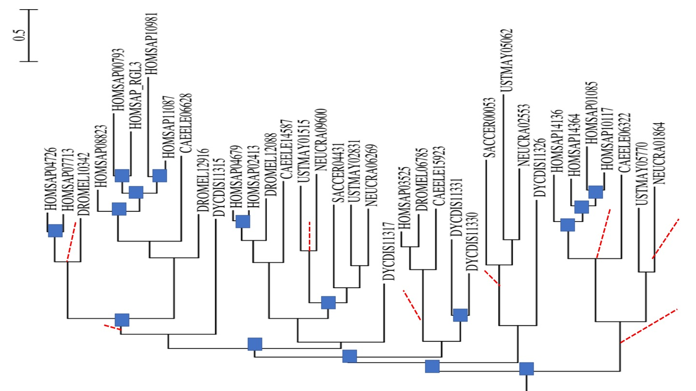

RasGEFs are important signalling proteins that diversified predominantly in amoebozoa and opisthokonta (a.k.a. fungimals/funimals, i.e.  fungi & animals; see [https://www.cell.com/trends/ecology-evolution/fulltext/S0169-5347(19)30257-5](https://www.cell.com/trends/ecology-evolution/fulltext/S0169-5347(19)30257-5) for a review on the relationship among eukaryotes). We want to reconstruct the gene duplications and losses of this dynamic gene family within amoebozoa and opisthokonta. However, this subtree of the RasGEF’s is a real life tree and real life is not so easy. Look at the following tree of RasGEF(CDC25) containing proteins .

The six letter abbreviations are as follows HOMSAP; human, DROMEL: fruitfly; CAEELE: nematode worm; DYCDIS: slime mold; USTMAY: basidomycete corn smut fungus; NEUCRA ascomycete red bread mould fungus; SACCER ascomycete baker's yeast.

The fully resolved species tree for these species is as follows

Assume I have correctly rooted this gene tree. We are going to annotate the RasGEF tree. However reconciling the RasGEF protein tree in terms of duplications and speciations, strictly using the fully resolved species tree would yield (too) many ancient duplications and differential gene losses. So instead, annotate internal nodes of the RasGEF protein tree in terms of gene duplications, gene losses and speciations where this designation is not contradictory to the unresolved (consensus) tree. (i.e. perform tree reconciliation using an unresolved species tree An useful “partially unresolved” species tree for these species could be the one below. Another way to say what you need to do, is to use your common sense and avoid spurious “ghost” duplications and losses. As a consequence, this strategy does not really specific exactly where you draw gene losses in the gene tree; so that is up to you)

> ## Exercise: Indicate in the RasGEF gene tree where you think duplications and gene losses ocurred  
>
>> ## Solution
>> 
>> 
> {: .solution}
{: .challenge}

Your annotated tree in principle also contains the orthology relations between all species in the tree. Consider these orthology relations. 
> ## Exercise:  Specifically, which genes in human are orthologous to which genes in fruitfly and to which genes  in yeast?. 
>
>> ## Solution
>> 
>> 
>> Note that the absence in cerevisiae/yeast is ususal for these large gene families. the yeast genome  is secondarily small.
> {: .solution}
{: .challenge}

We annotated the gene tree using the uncresolved species tree, but if we would have used the fully resolved species tree, and applied strict tree reconliation we would have infered duplications that are very unlikely, have a duplication concistency score of 0 and create also inlikley losses. We refer to these as spurious duplications. 

> ## Exercise:  Circle/indicate in the gene tree where strict reconciliation would have given “spurious” duplications and losses. 
>
>> ## Solution
>> 
>> 
> {: .solution}
{: .challenge}

