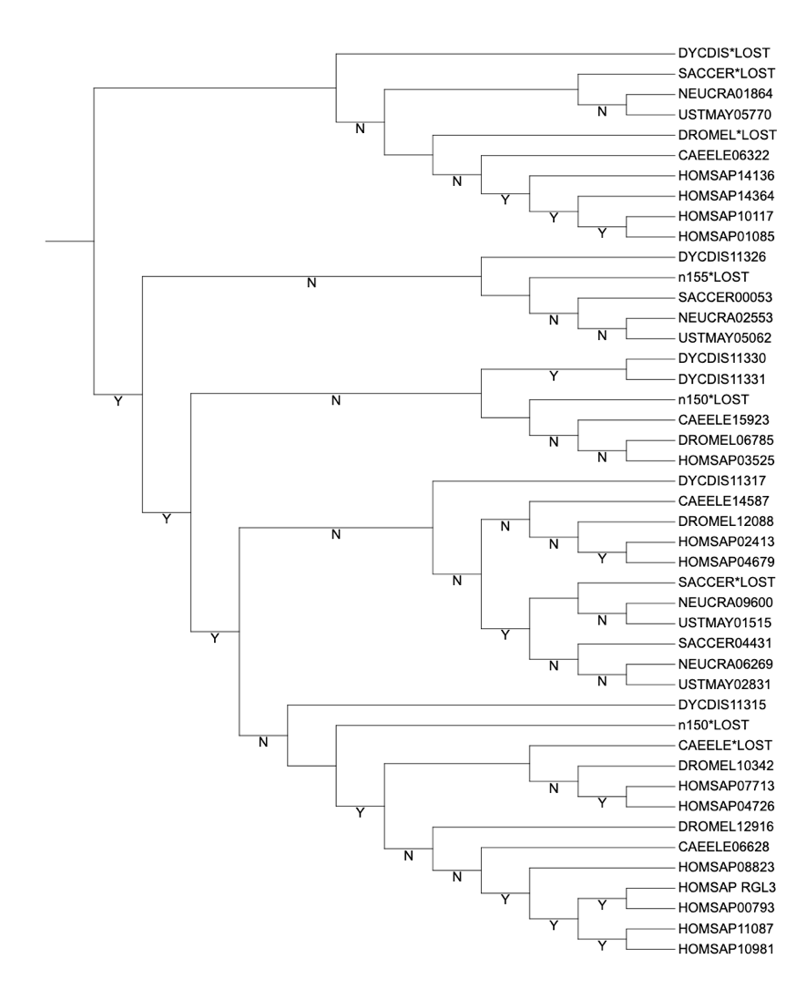

As explained in the lectures methods exist to do tree reconciliation automatically. One of the most intuitive ones is NOTUNG, which is installed on cocalc. 

The gene and species tree files located for this exercises are present in  `~/data_bb3bcg20/Block2/COOI/`. Copy them (all the files containing .nwk) to your working folder. 

In your folder of COOI, you should see a file containing a newick version of the RasGEF gene tree above: RasGefGeneTree.nwk. Look at it with more or cat (e.g.. on the command line type “more RasGefGeneTree.nwk”). Can you read this tree? What do the numbers after the “:” symbols represent?
> ## Exercise: Can you read this tree? What do the numbers after the “:” symbols represent?
>
>> ## Solution
>> The tree is too big too easily read (for me)\
>> Numbers after `:` are branch lengths
> {: .solution}
{: .challenge}

We are now going use the program NOTUNG. Besides NOTUNG’s use as a tool that can allow for noisiness in gene trees by taking a bootstrap threshold, it can also deal with noisiness by using an unresolved species tree (which NOTUNG refers to as non-binary). We have also provided the unresolved species tree for the species in our gene tree in: speciestree_rasgef_unresolved.nwk. Also look into this file (with more or cat or less. 

This is very simple tree. 
> ## Exercise: Why does this tree not contain the `:` symbol? Can you recognize the unresolved nodes in this simple text file?
>
>> ## Solution
>> It is just the topology, that is all you need for this type of reconciliation; nice timed species trees do also exist though.
>>
>> The unresolved nodes can be recognized as `(a,b,c)`
> {: .solution}
{: .challenge}

Get the following to run: `java -jar ~/data_bb3bcg20/bin/Notung-2.9.1.5.jar   RasGefGeneTree.nwk -s speciestree_rasgef_unresolved.nwk --reconcile  --events`
   NOTUNG has produced a bunch of output. Inspect the files, `RasGefGeneTree.nwk.reconciled.events.txt` and `RasGefGeneTree.nwk.reconciled`. 
   
   
> ## Exercise:   What type of information do these files seem to contain? 
>
>> ## Solution
>> The .events.txt file contains all the dups and losses as a table
>> The .reconciled tree contains the tree from previous but with duplications and losses.
> {: .solution}
{: .challenge}

[//]: ## (Are ?? cD species nodes that exist in the gene tree but not in  the unresolved tree? ??? )

A tree is easier to look at I think. So we want to visualize the output on a tree. This is unfortunately not completely trivial, so we provide a cookbook to visualize the reconciled tree. 
        
In a browser go to the website iToL at [https://itol.embl.de/](https://itol.embl.de/)
 
Upload your reconciled RasGEF gene tree file to iToL (afeter copying the `RasGefGeneTree.nwk.reconciled` to your local machine) either as file or by pasting the text into box. 
    
Ok. Now we need to do some things to make all the reconciled stuff human readable. First select in the panel to the upper right under basic -> mode options -> branchlengths, set to ignore 
    
Then under advanced -> bootstrap/meta data, set to Display. And then select as Data source “D”, select text (if it is not already selected) and increase the font size to something readable.
    
> ## Exercise:   Compare this output to your own answer when manually re
>
>> ## Solution
>> 
>>
>>
>>±Same
>>
>>Exception is the root node, which is not a duplication?
> {: .solution}
{: .challenge}
    
    
Als inspect the file `RasGefGeneTree.nwk.reconciled.events.txt`, 
> ## Exercise:  How can you see how this file summarizes the entire dynamics of this gene family for you? What limits the intepretability? 
>
>> ## Solution
>>Yes it contains per branch all the events, but you need to know what the node id’s are. NB perhaps you make it more human readable by adding node-id’s yourself to the species tree … 
> {: .solution}
{: .challenge}
    
We want to do the automatic reconciliation also strict for the fully resolved tree. However NOTUNG then does not run because it does not want to overwrite the output files. Move your output files to another name, so you keep them but they are not in the way for NOTUNG. You can do that in using the `mv` command  e.g. `mv RasGefGeneTree.nwk.reconciled RasGefGeneTree.nwk.reconciled.bkp`. 

Now run NOTUNG as above but use a different fully resolved species tree: `speciestree_rasgef.nwk`. Also look at these results and compare them to the result from using an unresolved species tree.

> ## Exercise:  what is the difference between notung with a fully resolved species tree and with an unresolved species tree? 
>
>> ## Solution
>>
>>
>> Many more losses and some more duplications; see below; and especially losses and duplications created by spurious duplications where the species tree is not exactly followed  …  
> {: .solution}
{: .challenge}

[//]: ## (To compare trees: http://phylo.io/ try it, except ) 

In the lectures we also discussed that the another strength of NOTUNG is to use support values to inform its decision on which parts of the tree to believe and which not. So let us also run this on our tree and see what NOTUNG makes of it. Use it as follows: `java -jar ~/data_bb3bcg20/bin/Notung-2.9.1.5.jar RasGefGeneTree2.nwk -s speciestree_rasgef.nwk --rearrange --threshold 70 --edgeweights name`

Where NB we use a gene tree 2 because that gene tree contains support values. 
> ## Exercise: Is the output same/different from using the unresolved species tree in terms of total number of events?  Is the output the same/different in terms of the exact location of these events and in terms of the topology of the gene tree?
>
>> ## Solution
>>
>> 
>>  output same in terms of number of events \
>> output different in terms of exact location of these events
> {: .solution}
{: .challenge}
