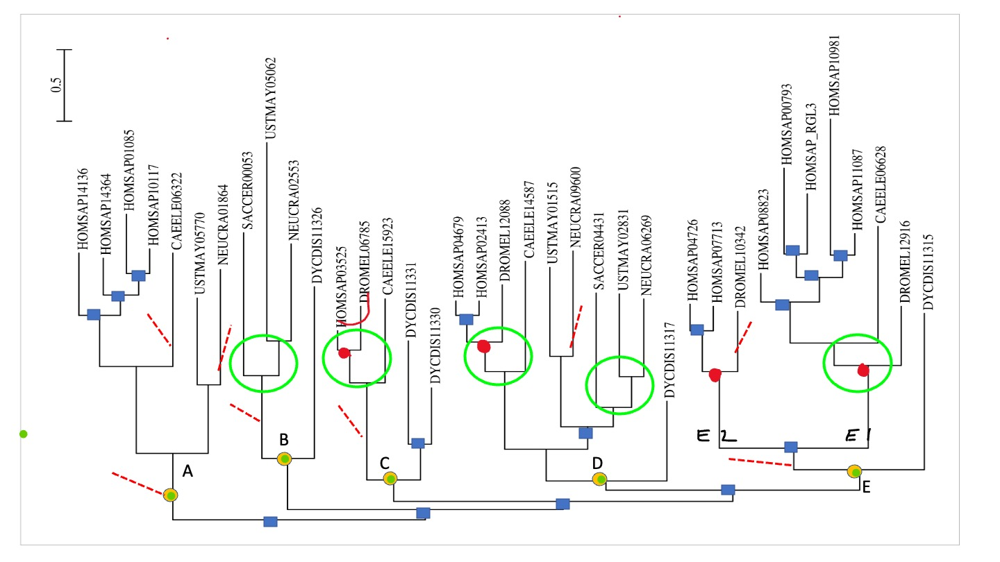
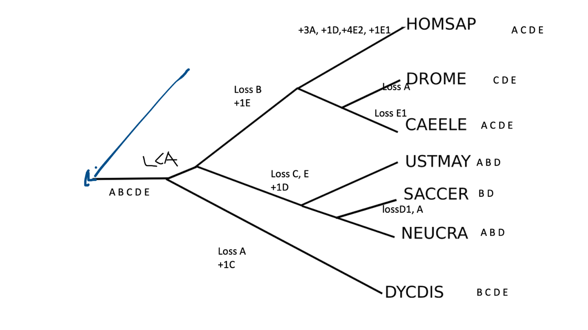

So we have looked at the RasGEFs by hand and by NOTUNG. We should now have some kind of consensus on what events happened in this gene tree. Now we are going to project all these events on the species tree. I think for this we should use the correct (and thus fully resolved) species tree which we have given in one of the earlie rexercises. On this species tree we want to see the  events (i.e. losses and duplications) as well as the ancestral gene content, e.g. how many RasGEFs did the animal ancestor prosses. This will give a reconstruction of the ancestral repertoire of RasGEF proteins. So specifically what you need to do is: 

*Think about which reconciliation you are going to use for this? (your own or notung's)
* Mark, with e.g. an asterix or a colored circle, in the gene phylogeny those speciations that specifically correspond to a single gene in the last common ancestor (LCA) of the species considered (i.e. the common ancestor of slime mold, animals & fungi).
* Consider all genes that descend from each of these speciation an "orthologous group". How many (orthologous groups of) RasGEFs were present at which ancestor?
* Track for each gene desceding from a single gene in the LCA its losses and duplications. And put those in the species tree of (orthologous groups of) RasGEF happened at which branch? 

> ## Exercise: draw it all on the species tree 
>
>> ## Solution
>> So first I would consider the gene tree from before with respect to the LCA speciation nodes. And count how many I see. \
>> \
>> I have labeled the LCA nodes with letters\ 
>> And then you can project these LCA orthogroups/nodes and the subsequente duplications and loss to the species  tree:
>> 
> {: .solution}
{: .challenge}

> ## Exercise: Which organism(s) contain(s) most "ancestral" RasGEFs (i.e. an orthogroup already present in the unikont ancestor)? Which organism contains most RasGEFs?
>
>> ## Solution
>>
>> Human, C.elegans and Dyctiostelium possess most “ancestral” RasGEFs
>> Human contains most RasGEFs thanks to more recent duplications
>> 
> {: .solution}
{: .challenge}
