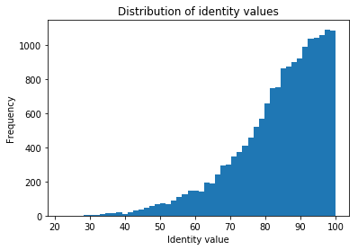
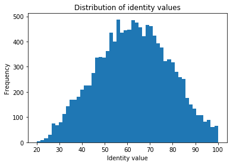
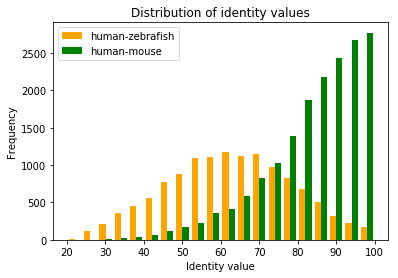

# blast

In this excercise we want to compute orthologs via the BBH method between human and mouse, and then plot the distribution of identities, in order to find out how well (on average)  two orthologs between these two species areconserved? For this we need to write our own python script to parse the blast output between these two species and to plot it. 

Instead of running these blast searches yourself, we have already performed for you an blast search of all human proteins to all mouse proteins. And we also did all homology searches of all mouse proteins versus all human proteins. (for a detailed motivation on why we did this for you, fell free to ask me; see e.g. https://blast.ncbi.nlm.nih.gov/Blast.cgi?CMD=Web&PAGE_TYPE=BlastDocs for more detail on BLAST).

The files containing the output of these searches can be found at  `~/data_bb3bcg20/Block2/COOII/`

Can you find these files. Please look at them. Relevant for you is that column1 is gene identifier species 1, column2 is gene identifier species 2, column 3 is the percentage identity of the hit, column 11 is
the e\-value and column 12 the bitscore. For the human vs mouse file, species 1 is human and species 2 is mouse. For the mouse vs human file, species 1 is mouse and species 2 is human. 

No need to code yet but this is the file that is going to serve as the basis for your very own orthology  between human and mouse, so I think your should look at it / browse it, before starting scripting.

# bidirectional_best_blast_hits

So now we want to go from blast hits to orthologs between human and mouse. For this we will use the bidirectional best blast hit heuristic, as explained in the lectures. And we are going to brush up our python skills. Given that we are going to do human and mouse, the relevant blast files are: blast_out_human_vs_mouse.txt and blast_out_mouse_vs_human.txt.

As explained we already did the blast. So we just need to parse it in such a way we get our candidate orthologs. However, this is relatively a big task, which we think should be done in one piece of code. 

You can write your code whereever your like, we will be assuming you will be using anaconda jupyter notebook on your laptop. But you can also use another python editor on your laptop (or on gemini). So we now need to download the blast file from gemini to your laptop. 

Okay, now how to write this bidirectional best hit script. To approach this relatively big task we want to do a couple of things.
1. Write the task first as a pseudo code on a piece of paper or in word document or someting. Also think about some intermediate points where you can summarize the progress of the script sofar. (i.e. print!)
2. Lets start coding: start again by reading in the blast file. The file contains 12 columns: 'qseqid sseqid pident length mismatch gapopen qstart qend sstart send evalue bitscore'. Try to figure out what these columns mean. A note: what consitutes a best hit? We want you to use bitscores rather than sequence identities or e-values. (Although of course we could also test to what extent that makes a difference). Use two distinct dictionaries to keep track of the hits with the best score per query protein: one dictionary for human and an other dictionary for mouse. Every dictionary should have the protein identifier of the query sequence as a key and as a value a list containing protein identifier of the hit/subjec, the bitscore and the sequence identity.
3. Loop over all human proteins with a best hit in mouse and check if that mouse protein has the same human protein as a best hit. If they do, these are the biderectional best hits (BBH) and you can write the pair to a  data structure that you can use later (or perhaps to a file). Also, report the number of pairs to the screen.

> ## Exercise:  How many bidirectional best blast hits do you find between human and mouse? 
>
>> ## solution
>> 17181
>{: .solution}
{: .challenge}

# distribution_of_identities_of_orthologs

We want to see how similar the orthologs between human and mouse are. Specially we want you to write a script that gives the distribution of idenities of all the bidirectional best hits that you have just created and report this as a histogram.

After you have finished this script, if you would rather have made a histogram of e\-values, how would you have done that? i.e. to where would you have to go back and change something?

Inspect the resulting distribution of protein sequence identities. 
> ## Exercise:  What identify is most likely for a human\-mouse orthologous pair? Are there orthologous proteins between human and mouse at less than 60% sequence identity?  
>
>> ## solution
>> The most likely identity is between 90 & 100 
>>
>> There are orthologs with less than 60% sequence identity
>>
>> 
>{: .solution}
{: .challenge}

# also_make_bbh_orthologs_and_identity_distribution_for_human_zebrafish 

Use the code above to do the same for human and zebrafish (i.e. <b>identify</b> bbh orthologs and <b>plot</b> their identity). We provide two blast files to do this at   `~/data_bb3bcg20/Block2/COOII/`, i.e. `blast_out_human_vs_zebrafish.txt` and `blast_out_zebrafish_vs_human.txt`

You can do the same analysis for human and zebrafish as you did for human and mouse, in multiple ways, for example you can

1. copy and paste your code below with the zebrafish_human files replacing the human_mouse files
2. rewrite your code into functions and call these functions below
3. replace human and mouse files in the above with human and zebrafish files and execute everything again ... 

NB for option 1 and 3 there is a danger because in python notebooks your global variables exist in all cells. As a consequence the dictionaries you have used to make bbh_orthologs from human and mouse will also exist/still be filled when doing zebrafish. As a solution: either clear the variables (e.g. restart the kernel), or rename the variables, or perhaps best: use a function.

Inspect the distributions. 
> ## Exercise:  How do the two distributions compare? What is the sequence identity of the most diverged orthologs between human and zebrafish, and what is the highest sequence identity between human and zebrafish? Why are there such large differences between these proteins?  
>
>> ## solution
>>
>> The distributions are very different, the zebrafish-human orthologs have a much lower average, and a much wider distribution 
>> 
>> The sequence identity of the most diverged orthologs between human and zebrafish is 20%
>>
>> The highest sequence identity between human and zebrafish is 100%
>>
>> Why there are such large differences amongst the orthologs, is something we will discuss in somoe more depth tomorrow. But very shortly we cannot yet fully explain/model the varying divergence rates between proteins know. "Apparently" purifying selection keeps a few proteins perfectly conserved; While the others to lesser or bigger extend are either allowed to diverge neutrally OR maybe some of them are adaptively selected to diverge
>>
>> 
>{: .solution}
{: .challenge}

> ## Exercise:  Optional: can you also plot both distributions in the same graph?
>
>> ## solution
>> 
>>
>{: .solution}
{: .challenge}
