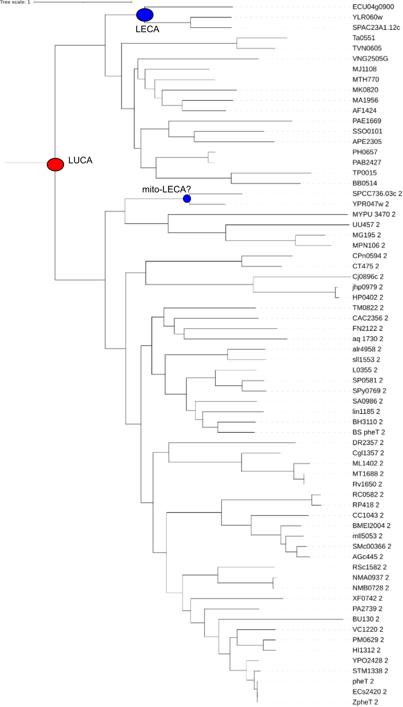
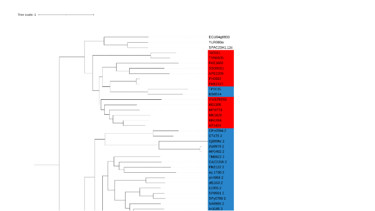

Horizontal gene transfer

make a directory
`cd ~/GenomeBioinformatics/Block2/`

`mkdir COO-III`

We are going to reproduce a (classic) finding on horizontal gene transfer from the literature. We will use the COG database which is a collection of (inclusive) clusters orthologous genes that have also been annotated with a function common to all genes in a COG as well as solving common (and ancient) gene fusions and fissions. 

We are going download from the the COG database the file that contains a list of all the COGs, their functions and the proteins assigned to each COG. In the public ftp folder [https://ftp.ncbi.nlm.nih.gov/pub/COG/COG/](https://ftp.ncbi.nlm.nih.gov/pub/COG/COG/), it is the file labeled `whog`. You have multiple options to do this. For example you can go to your folder for Block2 COOIII and use  wget to directly get this file intyour folder using e.g. `wget https://ftp.ncbi.nlm.nih.gov/pub/COG/COG/whog`. You could for example also go the ftp site ([https://ftp.ncbi.nlm.nih.gov/pub/COG/COG/](https://ftp.ncbi.nlm.nih.gov/pub/COG/COG/)), download it, and from your laptop `scp` it to  from there to gemini your laptop. No matter how you got the file, inspect the file. 

> ## Exercise: How many COGs does the whog file contain?
>
>> ## Solution
>> by doing `grep -c COG whog`
>>
>> or control-F in some text editor 
>>
>> you should find that the file contains 4873 COGs
> {: .solution}
{: .challenge}

Search for COG0072 in this “whog” file and inspect it.

> ## exercises:  What is its function of COG0072
>
>> ## Solution
>>[J] COG0072 Phenylalanyl-tRNA synthetase beta subunit
>> 
>>so a  subunit of the t-RNA synthetases for phenylalanyl (F) that couples the tRNA(s) for this amino acid to that amino acid
> {: .solution}
{: .challenge}

Make a list file that contains all members of COG0072 such that we can use seqtk. (i.e. a simple text file with fasta sequence identifiers without the “>” sign below each other).

> ## exercises: How many identifiers do you have in your list file? (i.e. how many proteins where assigned in the whog file to COG0072
>
>> ## Solution
>> If you take the multiple identifiers for the eukaryotes into account:  68, otherwise a little bit less
> {: .solution}
{: .challenge}

The sequences that correspond to the identifiers from the whog file are present in `~/data_bb3bcg20/Block2/COOIII/myva.fa`. Collect all sequences assigned to COG0072 from the database myva.fa using e.g. `seqtk subseq ~/data_bb3bcg20/Block2/COOIII/myva.fa your_file_with_sequence_identifiers > your_new_fast_file`.

> ## exercises: How many sequences do you have in your  fasta file?
>> ## Solution
>> Should be 68 sequences
> {: .solution}
{: .challenge}

Align your sequences using MAFFT (see previous COO’s for instructions)

Make a tree of these sequences using IQTREE. However, note that this is already a fairly large collection of sequences. So, I would advise to run IQTREE using the fast option using e.g. `iqtree -s [your alignment file] -fast -m LG+G4`. In this particular case for the bits of tree that we are interested in, running IQTREE with this fast option should not matter, but generally trees reconstructed using the fast option are much poorer. Feel free to run the tree with and without the fast option to compare.

Open your tree in iToL (see previous computer exercises for specific instructions on how to upload treefiles to iToL and visualize them there). Put the tree in a layout that you find most easy to browse. 

To make sense of the tree it is relevant to know Ta, TVN, PH, PAB, PAE, SSO, APE, VNG, MJ, MTH, MK, MA, AF are all archaea; YLR060w, YPR047w_2, SPAC23A1.12c, SPCC736.03c_2, ECU04g0900 are eukaryotic sequences; and all other sequences are bacteria. 

> ## exercises:  In this tree, can you annoate the speciations in this tree that more or less correspond to  LUCA and potentially to LECA's (iffy bc the only eukaryotes are a few fungi)  in this tree?
>
>> ## Solution
>> 
>> 
>> See above, blue ball LUCA, red ball LECA
> {: .solution}
{: .challenge}

Try to find the inter domain HGT branch(es) in the tree. Also consider which genes are from the acceptor species and which lineage is the donor. 

 
> ## exercises: indicate in the tree where the HGT took place and who the acceptors and donors were 
>
>> ## Solution
>> 
>>
>> TP0015, BB0514, lineage donor is archaea, transfer branch green … 
>> A colored tree , and with branches rotates to better isolate the transfer receivers, makes it easier to see perhaps …  red, archaea, blue bacteria
>> 
Use https://ftp.ncbi.nlm.nih.gov/pub/COG/COG/org.txt and https://ftp.ncbi.nlm.nih.gov/pub/COG/COG/whog to piece together the name of the lineage that was the recipient of transfer? 
spirochaetes (or in the file org.txt Chlam-Spir)
)
> {: .solution}
{: .challenge}

> ## exercises:  Can you find the paper that inspired us to make this exercise? 
>
>> ## Solution
>>We utilized this ancient paper: https://genome.cshlp.org/content/9/8/689.long as a source, because then we could use a limited species set, i.e. a rather old version of the COGs to see the transfer. In addition the author of the COGs is also the author of this paper making it likely that the inference and the data match.
>>
>>This is a more recent paper that documents the tRNA synthetases
>> (https://link.springer.com/article/10.1007/s00239-016-9768-2)
>> 
>> in that more recent study besides asgardarchaeal origin, endosymbiotic origins you also see some incidental interdomain transfers
> {: .solution}
{: .challenge}

